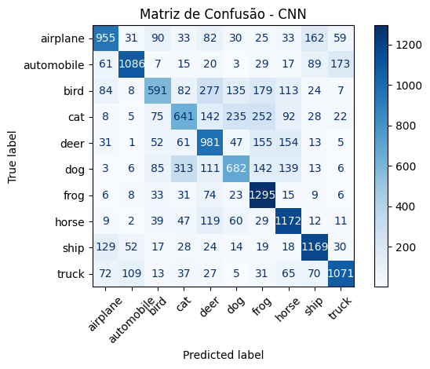
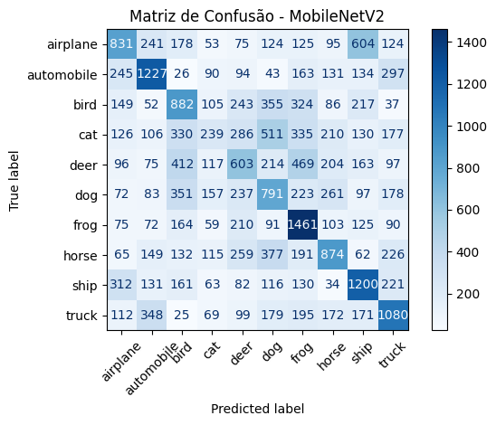
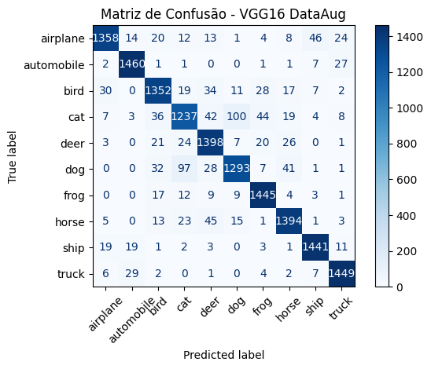
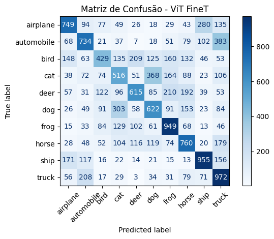

# Relatório Final da Atividade Prática 1: Comparativo e Análise de Resultados

Autor: Aurelio Thomasi Junior

Link repositorio: [Repositorio Git](https://github.com/Hideroshi/PUC/tree/07150849e13a0ec701861b7673508f9b80caf3df/Avaliacao_1)

## Introdução

***(IMPORTANTE)***
**A motivação para essa entrega posterior:** a primeira testagem, embora funcional, *teve limitações desde o início*. 

Durante o desenvolvimento dos experimentos foram encontrados diversos problemas relacionados ao ambiente de execução, consumo de memória e compatibilidade entre bibliotecas. Inicialmente, verificou-se que o TensorFlow estava executando todos os treinamentos utilizando apenas a **CPU**, apesar da disponibilidade de uma GPU NVIDIA RTX 3060. Como consequência, os treinamentos apresentavam tempos extremamente elevados, chegando a várias horas (chegou a levar 10 horas para 1 fit) em alguns modelos, além de elevado consumo de memória RAM (estourando 20GB).

Após a investigação do problema, foi identificado que a versão do ambiente Python utilizada possuía incompatibilidades com a versão do TensorFlow compatível com aceleração por GPU. Para solucionar esse problema, foi criado um novo ambiente virtual utilizando o Python 3.10, juntamente com versões compatíveis do TensorFlow, CUDA e cuDNN. Após essa configuração, a GPU passou a ser reconhecida e utilizada durante o treinamento, reduzindo significativamente o tempo de processamento dos modelos em até 10x.

Outro desafio importante ocorreu durante os experimentos com as arquiteturas VGG16 e Vision Transformer (ViT). Como essas redes trabalham com imagens de entrada de 224 × 224 pixels, armazenar toda a base de dados redimensionada simultaneamente em memória resultava em elevado consumo de RAM, ocasionando erros de alocação de memória (MemoryError) e instabilidade do ambiente de execução.

Para contornar esse problema, o pipeline de pré-processamento foi reformulado. Em vez de manter todas as imagens carregadas em memória, elas passaram a ser processadas em pequenos lotes, redimensionadas, pré-processadas e armazenadas em arquivos .npy. Posteriormente, foi desenvolvido um gerador de dados utilizando tf.data.Dataset.from_generator, permitindo que apenas os lotes necessários fossem carregados durante o treinamento. Essa abordagem reduziu drasticamente o consumo de memória e tornou possível treinar modelos maiores de forma estável, trocando o treinamento inicial com 10 mil imagens (ou 5 mil no VGG), para as 50 mil do dataset. 

Também foram realizados ajustes no pipeline de dados, incluindo o uso de shuffle, batch e prefetch(AUTOTUNE), permitindo que a leitura dos dados ocorresse em paralelo ao processamento na GPU. Dessa forma, além da redução no consumo de memória, houve melhor aproveitamento dos recursos computacionais e diminuição do tempo total de treinamento que mesmo com a GPU chegou a demorar 10 horas para treinar apenas o ViT.

Durante a implementação do Vision Transformer, ainda foram encontrados problemas relacionados à compatibilidade entre implementações disponíveis da arquitetura. A versão inicialmente utilizada por meio do TensorFlow Hub apresentou desempenho ruim e tempo de processamento gigantesco. Após diversas tentativas de configuração, optou-se pela utilização da implementação oficial disponibilizada pela biblioteca Hugging Face (TFViTModel), que apresentou melhor compatibilidade com o ambiente desenvolvido e permitiu a execução correta dos experimentos.

Essas modificações no ambiente e no pipeline de processamento garantiram a estabilidade da execução dos experimentos, possibilitando o treinamento de todos os modelos avaliados e contribuindo diretamente para a melhoria dos resultados obtidos na etapa final do trabalho como poderá ser vista durante este relatório.

---

Neste relatório, vou detalhar a evolução do meu projeto de classificação de imagens utilizando o dataset CIFAR-10. 

A seguir, apresento uma análise detalhada de cada etapa, comparando os resultados antigos com os novos, explicando as mudanças adotadas e seus respectivos impactos.

O objetivo desta atividade foi comparar diferentes arquiteturas de Deep Learning para classificação das imagens da base CIFAR-10.

Foram avaliados cinco modelos:

```bash
CNN desenvolvida do zero;
MobileNetV2 utilizando extração de características;
VGG16 com Fine-Tuning;
VGG16 com Fine-Tuning e Data Augmentation;
Vision Transformer (ViT).
```

Todos os experimentos utilizaram a mesma divisão Holdout (70% treinamento e 30% teste), permitindo uma comparação justa entre os métodos.

Os primeiros 2 modelos foram testados de forma independente, e os últimos 3 utilizaram a mesma base tratada para economizar recursos computacionais e ter um melhor aproveitamento do tempo.


## 1. Metodologia e Configuração Experimental

### 1.1. Ambiente 
Para o ambiente de treino e teste inicial, ou seja **SEM GPU**, foi utilizada a seguinte configuração: 

| **Categoria** | **Componente** | **Versão / Informação** |
|-----------|------------|----------------------|
| Linguagem | Python | 3.12.5 |
| Deep Learning | TensorFlow | 2.18.0 |
| Deep Learning | Keras | 3.8.0 |
| Deep Learning | tf_keras | 2.18.0 |
| NLP | Transformers | 4.48.3 |
| Deep Learning | PyTorch | 2.12.1+cu126 |
| Hardware | GPU | NVIDIA GeForce RTX 3060 |
| Hardware | NVIDIA Driver (KMD) | 610.74 |
| Hardware | CUDA Driver (UMD) | 13.3 |


Já para o ambiente do segundo treinamento, **COM GPU**, foi utilizada a seguinte configuração:

| **Categoria** | **Componente** | **Versão / Informação** |
|-----------|------------|----------------------|
| Linguagem | Python | 3.10.10 |
| Deep Learning | TensorFlow | 2.10.1 |
| Deep Learning | tf_Keras | 2.10.0 |
| Biblioteca | NumPy | 1.23.5 |
| Biblioteca | OpenCV | 4.8.1 |
| Hardware | GPU | NVIDIA GeForce RTX 3060 |
| Hardware | NVIDIA Driver (KMD) | 610.74 |
| Hardware | CUDA (TensorFlow Build) | 11.2 |
| Hardware | cuDNN (TensorFlow Build) | 8 |

*Todas essas e outras instalações seguem compatibilidade com o python 3.10 e o TensorFlow 2.10.*

### 1.2. Ferramentas

Os experimentos foram realizados em um ambiente Python com as seguintes bibliotecas principais:
*   **TensorFlow/Keras:** Utilizados para a construção, treinamento e avaliação dos modelos de Deep Learning, incluindo a CNN desenvolvida do zero, o Fine-Tuning da VGG16 e a implementação do Vision Transformer.
*   **Transformers (Hugging Face):** Utilizada a classe TFViTModel para implementação do Vision Transformer (ViT). Essa biblioteca oferece uma versão mais atualizada e compatível do modelo em relação às implementações disponíveis no TensorFlow Hub.
*   **Scikit-learn:** Empregado para a divisão da base de dados (Holdout), implementação do classificador MLP da MobileNetV2, busca de hiperparâmetros com GridSearchCV e cálculo das métricas de avaliação e matrizes de confusão.
*   **NumPy:** Utilizado para manipulação de matrizes, processamento numérico dos dados e armazenamento dos batches das imagens.
*   **Pandas:** Utilizado para manipulação e organização de dataframes quando necessário ao longo dos experimentos.
*   **OpenCV (cv2):** Responsável pelo redimensionamento das imagens da base CIFAR-10 para o tamanho de entrada exigido pelos modelos pré-treinados (224×224 pixels).
*   **Matplotlib:** Utilizado para visualização dos resultados, incluindo matrizes de confusão, curvas de aprendizado e gráficos auxiliares.
*   **Pathlib, os e gc:** Utilizados para gerenciamento dos arquivos de batches, manipulação de diretórios e liberação de memória durante o processamento das imagens.
*   **Pickle:** Utilizado para leitura dos arquivos originais da base CIFAR-10 disponibilizados no formato binário *(data_batch_\*)*.

### 1.3. Dataset

O dataset utilizado foi o **CIFAR-10**, composto por 60.000 imagens coloridas de 32x32 pixels, igualmente distribuídas entre 10 classes distintas (ex: avião, automóvel, pássaro, gato, etc.), sendo oficialmente 50.000 para treino, e 10.000 para teste.

- No primeiro processo de treinamento para viabilizar a execução local e acelerar o processo de treinamento, uma amostra de **10.000** imagens foi extraída do conjunto de treino original, mantendo a proporção das classes. 

- Já no segundo processo de treinamento, foram utilizadas as **50.000** imagens para execução local, obtendo um resultado muito superior, já que foi disponibilizada uma quantidade maior para treinamento. 

**Pré-processamento dos Dados:**
*   **Normalização inicial:** Os valores dos pixels foram normalizados para o intervalo `[0, 1]` para facilitar a convergência do modelo.

```bash
X_base = X_base.astype('float32') / 255.0
```
*   **Pré-processamento específico:** Posteriormente, é feita uma aplicação de *preprocess_input()* nos modelos baseados em *Transfer Learning* para adequar as imagens ao formato esperado pelos pesos aprendidos na ImageNet.

*   **One-Hot Encoding:** Os rótulos das classes foram convertidos para o formato *one-hot encoding*, necessário para a função de perda *categorical crossentropy*.

### 2.3. Parâmetros Globais

Os seguintes parâmetros foram mantidos constantes em todos os experimentos para garantir a comparabilidade:

*   `learning_rate`: 0.001
*   `batch_size`: 32
*   `training_epochs`: 50
*   `random_seed`: 42 (para reprodutibilidade)

### 1.3. Batches para Transfer Learning

**Pipeline:**

1. **Pré-processamento das imagens:** As imagens originais do CIFAR-10 foram redimensionadas de `(32 × 32)` para `(224 × 224)` utilizando `OpenCV`, permitindo sua utilização em arquiteturas pré-treinadas no ImageNet. Em seguida, foi aplicado o `preprocess_input` da VGG16, responsável por realizar a normalização esperada pela rede.

2. **Armazenamento em lotes:** Em vez de manter todas as imagens em memória, os dados foram processados em lotes (`batch_size = 64`) e armazenados em arquivos `.npy`. Essa estratégia reduziu significativamente o consumo de memória RAM durante o treinamento.

3. **Armazenamento dos rótulos:** Os rótulos das imagens foram armazenados separadamente em um único arquivo (`y_vgg.npy`) e posteriormente convertidos para o formato *one-hot encoding* utilizando `to_categorical`.

4. **Carregamento sob demanda:** Foi implementado um gerador (`dataset_generator`) responsável por carregar apenas os lotes necessários durante o treinamento. Dessa forma, apenas uma pequena parte da base permanece em memória a cada instante.

5. **Divisão da base de dados:** A base foi dividida de forma estratificada em:
   * **70%** para treinamento;
   * **30%** para teste;
   * dos **70%** destinados ao treinamento, **20%** foram separados para validação.

6. **Construção do TensorFlow Dataset:** Os conjuntos de treinamento, validação e teste foram convertidos para objetos `tf.data.Dataset` utilizando `Dataset.from_generator`, permitindo integração direta com o TensorFlow e carregamento eficiente dos dados.

7. **Otimização do pipeline:** O conjunto de treinamento recebeu embaralhamento (`shuffle`) para aumentar a aleatoriedade das amostras, enquanto todos os conjuntos foram organizados em mini-batches de **32 imagens** e preparados utilizando `prefetch(AUTOTUNE)`, permitindo sobreposição entre leitura dos dados e processamento pela GPU durante o treinamento.

---

## 2. Descrição dos Experimentos

### 2.1. Experimento 1: CNN Treinada do Zero

Desenvolvimento de uma arquitetura de CNN personalizada, com pesos inicializados aleatoriamente e treinados exclusivamente nos dados do CIFAR-10.

#### 2.1.1 Descrição

O primeiro experimento utilizou uma CNN construída manualmente composta por camadas convolucionais, MaxPooling, Batch Normalization, Dropout e camadas totalmente conectadas.

Essa abordagem não utiliza conhecimento previamente aprendido, portanto toda a representação visual precisa ser aprendida diretamente da base CIFAR-10.

**Arquitetura da CNN:**


* **Camada de Entrada:** `(32, 32, 3)`
* **Bloco Convolucional 1:**
    * `Conv2D(128, kernel_size=3, strides=1, padding='same', use_bias=False)`
    * `BatchNormalization()`
    * `Activation('relu')`
* **Bloco Convolucional 2:**
    * `Conv2D(92, kernel_size=3, strides=1, padding='same', use_bias=False)`
    * `BatchNormalization()`
    * `Activation('relu')`
* **Camada de Redução Espacial:**
    * `MaxPooling2D(pool_size=2, padding='same')`
    * `Dropout(0.2)`
* **Classificador:**
    * `Flatten()`
    * `Dense(256, activation='relu')`
    * `Dense(10, activation='softmax')`
* **Regularização:** Foi aplicada regularização L2 (`kernel_regularizer=0.001`) nas duas camadas convolucionais para reduzir o risco de *overfitting*. Além disso, foram utilizadas camadas de **Batch Normalization** para estabilizar o treinamento e acelerar a convergência, e **Dropout (0.2)** para melhorar a capacidade de generalização do modelo.


#### 2.1.2 Treinamento

*   **Otimizador:** Adam.
*   **Função de Perda:** `categorical_crossentropy`.
*   **Métrica:** Acurácia.
*   **Callbacks:** `EarlyStopping` (para interromper o treino se a perda de validação não melhorar) e `ModelCheckpoint` (para salvar os melhores pesos).

Além disso, foram salvos os dados do modelo em um arquivo keras: 

```bash
model.save('./modeloAtividade1.keras')
```

Durante o treinamento observou-se evolução consistente da acurácia nas primeiras *Epochs* mas que decaiu e não teve melhorias segundo o o parâmetro *"val_loss"* até a 15 Epoch, ativando o *EarlyStopping* do algoritmo.

#### 2.1.3 Resultados

A validação estabilizou em torno de **64%** de acurácia, em contraste com o treinamento anterior (**54.7%**)
Apesar do desempenho inferior aos modelos pré-treinados, a CNN conseguiu aprender adequadamente a base tendo um resultado que serve como linha de referência para comparar o ganho obtido pelas arquiteturas baseadas em Transfer Learning mostradas a seguir.



### 2.2. Experimento 2: Extração de Características + MLP

Utilização de uma MobileNetV2, previamente treinada no dataset ImageNet, como um extrator de características fixo (congelado). As características extraídas foram usadas para treinar um classificador raso do tipo MLP (*Multi-Layer Perceptron*).

#### 2.2.1 Descrição

**Pipeline:**

1. **Extrator de Características:** Foi utilizada uma MobileNetV2 pré-treinada no ImageNet (`weights='imagenet'`). A rede foi configurada com `include_top=False` e `pooling='avg'`, produzindo para cada imagem um vetor de características de dimensão **1280**. Todos os pesos da rede permaneceram congelados (`trainable=False`), sendo utilizada apenas como extratora de atributos.

2. **Pré-processamento:** As imagens do conjunto CIFAR-10 foram redimensionadas de **32×32** para **224×224** pixels, tamanho de entrada esperado pela MobileNetV2. Em seguida, foi aplicado o `preprocess_input`, responsável por adequar os valores dos pixels ao padrão utilizado durante o treinamento original da rede no ImageNet.

3. **Extração das Características:** As imagens foram processadas em lotes (*batches*) de **256 amostras**, reduzindo o consumo de memória durante a extração dos atributos. Os vetores de características gerados para cada imagem foram armazenados em uma matriz e posteriormente salvos no arquivo \`X_mob.csv\`. Os respectivos rótulos foram armazenados em \`y_mob.csv\`.

4. **Classificador:** Os vetores de características extraídos foram posteriormente utilizados como entrada para um classificador do tipo **MLP (Multi-Layer Perceptron)** implementado com `MLPClassifier` da biblioteca Scikit-learn.

5. **Otimização de Hiperparâmetros:** O classificador MLP teve seus hiperparâmetros ajustados utilizando **GridSearchCV** com validação cruzada de **3 folds**, considerando:
   * `hidden_layer_sizes`: `(256,)`, `(512,)` e `(512,256)`;
   * `activation`: `['relu', 'logistic']`.
   * `alpha`: `[0.0001, 0.001]`.
   O melhor modelo foi selecionado de acordo com o desempenho obtido durante a validação cruzada.

#### 2.2.2 Treinamento
Após a seleção do melhor modelo pelo GridSearchCV, foi realizada uma nova avaliação utilizando validação cruzada de 5 partições (5-fold Cross Validation), permitindo estimar o desempenho médio do classificador sobre diferentes divisões dos dados.

Entre todas as configurações avaliadas, a melhor combinação foi obtida utilizando uma única camada oculta com 512 neurônios, função de ativação ReLU e parâmetro de regularização L2 igual a 0.0001. Essa configuração apresentou a maior acurácia média durante a validação cruzada do GridSearchCV (32,34%), sendo selecionada para as avaliações posteriores.

#### 2.2.3 Resultados

A acurácia obtida durante a validação cruzada de cinco partições foi superior ao valor observado durante a etapa de seleção de hiperparâmetros. Essa diferença é esperada, já que o GridSearchCV utiliza uma estratégia de validação (3-fold) apenas para selecionar a melhor configuração do modelo, enquanto a avaliação final foi realizada utilizando validação cruzada de cinco partições sobre o modelo já otimizado, obtendo uma acurácia de **37,50%**, também superior ao do primeiro treinamento onde chegamos a 29.2%.
Este valor baixo deve-se pois as imagens são pequenas (32x32) e o algoritmo utiliza apenas o vetor de característica gerado, ficando bem inconsistente para o problema apresentado. 



### 2.3. Experimento 3: Fine-Tuning VGG16

Emprego de uma VGG16 pré-treinada e seu subsequente re-treinamento (fine-tuning) no dataset CIFAR-10.

#### 2.3.1 Descrição

**Arquitetura da VGG16 Fine-Tuning:**

* **Entrada:** `(224, 224, 3)`

* **Base Convolucional (VGG16):**
    * Modelo pré-treinado no **ImageNet** (`weights='imagenet'`).
    * Utilização de `include_top=False`, removendo as camadas totalmente conectadas originais.
    * As **15 primeiras camadas** da VGG16 permaneceram congeladas (`trainable=False`).
    * Apenas as **4 últimas camadas convolucionais** foram descongeladas para realizar o *Fine-Tuning*, permitindo sua adaptação ao conjunto CIFAR-10.

* **Camada de Pooling:**
    * `GlobalAveragePooling2D()`
    * Responsável por reduzir os mapas de características produzidos pela VGG16 em um vetor de atributos, diminuindo o número de parâmetros do classificador.

* **Classificador:**
    * `Dense(512, activation='relu')`
    * `Dropout(0.3)`
    * `Dense(256, activation='relu')`
    * `Dropout(0.2)`
    * `Dense(10, activation='softmax')`


As primeiras camadas permaneceram congeladas, enquanto apenas as quatro últimas camadas convolucionais foram ajustadas para a nova tarefa e além disso, a parte totalmente conectada foi substituída por novas camadas Dense adaptadas ao problema.

Durante o desenvolvimento foram necessárias diversas modificações importantes, sendo o principal problema encontrado o alto consumo de memória. Como todas as imagens eram redimensionadas para 224×224 pixels, carregar toda a base simultaneamente ultrapassava a memória disponível (passando de 20GB).

A solução adotada foi:
- Salvar as imagens pré-processadas em batches;
- Utilizar np.load(..., mmap_mode="r");
- criar um tf.data.Dataset que carregava apenas o batch necessário.

Essa abordagem reduziu significativamente o consumo de memória e permitiu utilizar toda a base CIFAR-10.

Outro problema foi o generator de batches, que retornava os batches completos provocando inconsistências entre ordem das imagens, índices do conjunto de teste e rótulos. O problema se extendia dos treinamentos aos resultados e mesmo atingindo 90% de acurácia durante o processo de treino, a matriz de confusão apresentava valores próximos de 10%. 

Após investigação exaustiva, verificou-se que os rótulos estavam desalinhados em relação às imagens, e então o generator foi modificado para produzir uma imagem por vez, mantendo a mesma ordem utilizada pelo model.predict(). Depois disso, os resultados passaram a refletir corretamente o desempenho obtido no treinamento. 

#### 2.3.2 Treinamento

*   **Otimizador:** Adam.
*   **Função de Perda:** `categorical_crossentropy`.
*   **Métrica:** Acurácia.
*   **Callbacks:** `EarlyStopping` (para interromper o treino se a perda de validação não melhorar) e `ModelCheckpoint` (para salvar os melhores pesos).

Além disso, foram salvos os dados dos melhores pesos em um arquivo para load posterior: 

```bash
model.save('./vgg16_fineT.weights.h5')
```

#### 2.3.3 Resultados

O Fine-Tuning apresentou um salto extremamente significativo em relação aos modelos anteriores e ao treinamento anterior.

O ajuste das últimas camadas permitiu adaptar os filtros aprendidos na ImageNet às características específicas do CIFAR-10, sendo esse o melhor ganho obtido até esse momento.

O algoritmo foi revisado, e as alterações (fazendo o resize para 224x224, por exemplo) o ponto chave para a mudança de resultados, fazendo com que o Fine Tuning saísse de **~10%** de acurácia, para **~91,43%**. 


### 2.4. Experimento 4: Fine-Tuning VGG16 com Data Augmentation

Emprego de uma VGG16 pré-treinada e seu subsequente re-treinamento (fine-tuning) no dataset CIFAR-10. Esta abordagem incluiu a aplicação de técnicas de aumento de dados (*Data Augmentation*) para melhorar a generalização.

#### 2.4.1 Descrição

Neste experimento foi utilizada exatamente a mesma arquitetura do Fine-Tuning, a única diferença foi a aplicação de *Data Augmentation* durante o treinamento.

Para o Data Augmentation foram utilizadas transformações aleatórias:

- Rotações;
- Zoom;
- Deslocamentos;
- Espelhamento horizontal.

As imagens de validação e teste permaneceram inalteradas.

#### 2.4.2 Treinamento

Inicialmente foi considerada a inclusão da camada de Data Augmentation diretamente na arquitetura, porem isso dificultava a construção do modelo e gerava incompatibilidades durante a montagem da VGG16.

Optou-se por aplicar o Data Augmentation diretamente no pipeline *tf.data.Dataset*, preservando a arquitetura original.

Essa abordagem também possui a vantagem de gerar novas versões das imagens a cada época de treinamento.

#### 2.4.3 Resultados

Embora o ganho tenha sido pequeno (aproximadamente 0,75%), o Data Augmentation tornou o modelo mais robusto e reduziu o risco de overfitting ao inserir imagens "diferentes" para treinamento, e com isso conseguimos obter o resultado de **~92.18%** de acurácia.



### 2.5. Experimento 5: Vision Transformer (ViT)

Neste experimento foi utilizado um modelo Vision Transformer (ViT) pré-treinado para realizar a classificação das imagens do conjunto CIFAR-10. Diferentemente das arquiteturas convolucionais utilizadas nos experimentos anteriores, o ViT representa cada imagem como uma sequência de pequenos blocos (*patches*), permitindo que o mecanismo de atenção aprenda relações entre diferentes regiões da imagem. 

#### 2.5.1 Descrição

Foi utilizado o modelo **ViT Base Patch16 224**, pré-treinado no ImageNet, mantendo seus pesos originais congelados e treinando apenas as camadas finais responsáveis pela classificação das dez categorias do problema.

**Arquitetura do Vision Transformer (ViT):**


* **Entrada:** `(224, 224, 3)`

* **Backbone (Vision Transformer):**
    * Modelo **ViT-Base Patch16** pré-treinado no **ImageNet**, carregado através da biblioteca **Hugging Face Transformers** (`TFViTModel.from_pretrained("google/vit-base-patch16-224")`).
    * Durante o treinamento, o modelo permaneceu inicialmente **congelado** (`trainable=False`), sendo utilizado como extrator de características.
    * O modelo divide a imagem em **patches de 16×16 pixels**, projeta cada patch em um vetor de características e processa toda a sequência utilizando mecanismos de **Self-Attention**, permitindo capturar relações globais entre diferentes regiões da imagem.

* **Extração de Características:**
    * Foi utilizado o **token CLS (Classification Token)**, obtido por:
      * `outputs.last_hidden_state[:, 0]`
    * Esse vetor representa toda a imagem e serve como entrada para o classificador.

* **Classificador:**
    * `Dropout(0.3)`
    * `Dense(256, activation='relu')`
    * `Dense(10, activation='softmax')`

* **Treinamento:**
    * **Função de perda:** `categorical_crossentropy`
    * **Otimizador:** `Adam (learning_rate = 1e-5)`
    * **Métrica de avaliação:** `accuracy`

Inicialmente foi utilizada uma implementação baseada no TensorFlow Hub, porém, diversos problemas foram encontrados:

- Tempo extremamente elevado por época;
- Uso excessivo da GPU;
- Travamentos do kernel;
- Incompatibilidades com TensorFlow mais recente.

Após diversos testes, optou-se pela substituição do modelo pelo Vision Transformer oficial disponibilizado pela Hugging Face *(TFViTModel)*.

Também foi necessário adaptar o pipeline de entrada. O modelo ViT espera imagens no formato: 
```bash
(batch, canais, altura, largura)
```
enquanto o TensorFlow utiliza:
```bash
(batch, altura, largura, canais)
```

Sendo assim, foi criado um novo dataset apenas aplicando "tf.transpose(x,[0,3,1,2])" sem necessidade de reconstruir toda a base de dados.

#### 2.5.2 Treinamento

*   **Otimizador:** Adam.
*   **Função de Perda:** `categorical_crossentropy`.
*   **Métrica:** Acurácia.
*   **Callbacks:** `EarlyStopping` (para interromper o treino se a perda de validação não melhorar) e `ModelCheckpoint` (para salvar os melhores pesos).

Além disso, foram salvos os dados dos melhores pesos em um arquivo para load posterior: 

```bash
model.save('./vit_best.weights.h5')
```
#### 2.5.3 Resultados

Apesar da arquitetura Transformer representar bons resultados em diversas tarefas de visão computacional, ela normalmente necessita de bases extremamente grandes para atingir alto desempenho.

O CIFAR-10 possui apenas 50 mil imagens, quantidade relativamente pequena para treinamento de Vision Transformers, ainda mais se levarmos em conta de foram utilizados apenas 35 mil para o treinamento. Além disso, neste experimento apenas o classificador final foi treinado, mantendo praticamente todo o resto congelado.

O resultado final foi uma acurácia de **~48.7%**.



## 3. Resultados e Discussão

Os resultados obtidos para cada abordagem são apresentados e discutidos a seguir. Irei discorrer sobre os experimentos os nomeando de acordo com o número do experimento, ficando da seguinte forma: 

```bash
1. - A CNN desenvolvida do zero;
2. - MobileNetV2 utilizando extração de características;
3. - VGG16 com Fine-Tuning;
4. - VGG16 com Fine-Tuning e Data Augmentation;
5. - Vision Transformer (ViT).
```

### 3.1. Comparação Geral de Desempenho

| Modelo                                | Acurácia Inicial | Acurácia Final | Variação | Resultado                                |
| :------------------------------------ | ---------------: | -------------: | -------: | :--------------------------------------- |
| CNN                                   |           54,70% |     **64,00%** |   +9,30% | ↑ Melhorou                               |
| MobileNetV2 + MLP                     |           29,20% |     **37,50%** |   +8,30% | ↑ Melhorou                               |
| VGG16 Fine-Tuning                     |           10,00% |     **91,43%** |  +81,43% | ↑ Melhoria Grande                       |
| VGG16 Fine-Tuning + Data Augmentation |          ~10,00% |     **92,18%** | +≈82,18% | ↑ Melhoria Grande                       |
| Vision Transformer (ViT)              |                — |     **48,70%** |        — | Executado apenas no experimento final |

Os resultados demonstram a alta capacidade da estratégia de Transfer Learning.

A CNN construída do zero conseguiu aprender padrões importantes da base, porém apresentou limitações devido à pequena resolução das imagens e à ausência de conhecimento prévio.

A MobileNetV2 apresentou um desempenho abaixo da média (se comparada a CNN, por exemplo) porque foi utilizada apenas como extratora de características, sem ajuste das camadas convolucionais.

Já a VGG16 apresentou desempenho significativamente superior. O Fine-Tuning permitiu adaptar as representações aprendidas na ImageNet ao domínio do CIFAR-10, obtendo uma acurácia acima dos 91%.

A adição de Data Augmentation ao Fine-Tuning proporcionou uma melhora adicional, reduzindo o overfitting e aumentando a capacidade de generalização do modelo.

Por fim, embora o Vision Transformer seja uma arquitetura moderna e extremamente poderosa, seu desempenho ficou abaixo do esperado para este conjunto de dados. Isso está relacionado principalmente ao tamanho relativamente pequeno do CIFAR-10 e ao fato de que Transformers costumam necessitar de volumes muito maiores de dados para superar arquiteturas convolucionais tradicionais.

---

## 4. Conclusão

Entre todos os modelos avaliados, o VGG16 com Fine-Tuning e Data Augmentation apresentou o melhor desempenho, atingindo aproximadamente 92,18% de acurácia, além das melhores matrizes de confusão e dos maiores valores de precisão, recall e F1-score.

O trabalho também evidenciou a importância da construção correta do pipeline de dados. Problemas relacionados ao carregamento em memória, organização dos batches e alinhamento entre imagens e rótulos impactaram diretamente os resultados obtidos e precisaram ser corrigidos antes da avaliação final. A adoção de um pipeline baseado em tf.data.Dataset com carregamento incremental em batches permitiu treinar modelos complexos utilizando toda a base CIFAR-10 mesmo com limitações de memória, mantendo consistência entre treinamento, validação e teste.

De forma geral, os experimentos mostraram que arquiteturas convolucionais pré-treinadas ainda representam a alternativa mais eficiente para conjuntos de dados de tamanho moderado como o CIFAR-10, enquanto modelos Transformer tendem a apresentar melhor desempenho apenas quando treinados com volumes substancialmente maiores de dados.