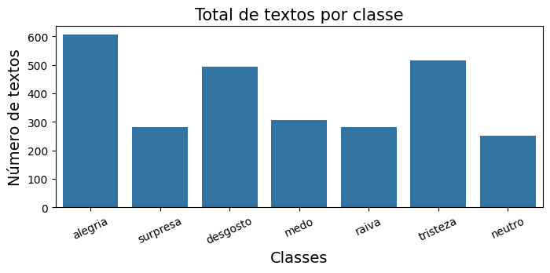
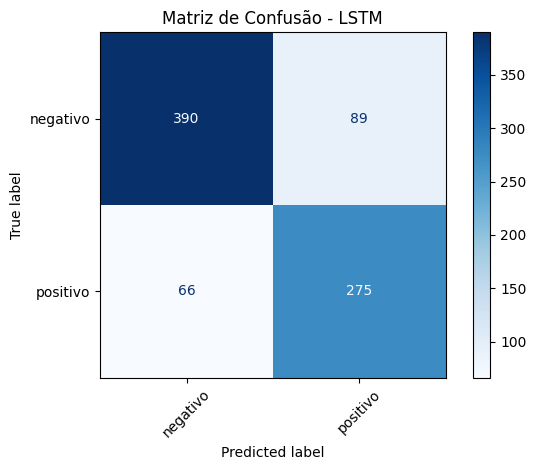
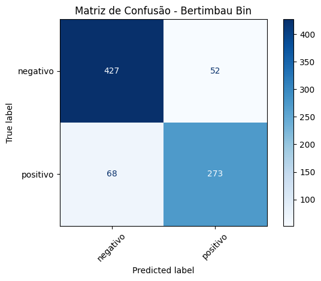
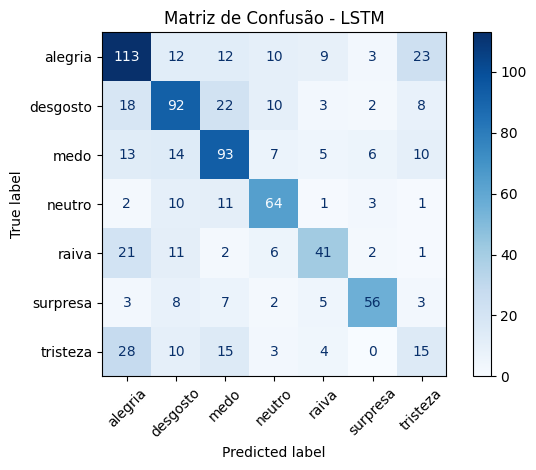
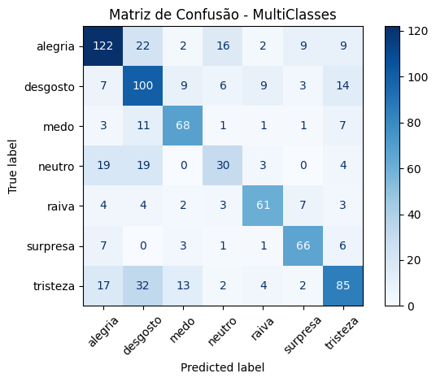

# Relatório - Classificação de Textos utilizando LSTM e Transformer

## Arquivo 

Os arquivos podem ser encontrados no link: [Repositorio Git](https://github.com/Hideroshi/PUC/blob/7e46fdf94a7d57ba8458d038560c4ca0c97d3747/atividadePratica_2.ipynb)

## 1. Importação das bibliotecas

Nesta etapa foram importadas as bibliotecas necessárias para o desenvolvimento do experimento, incluindo ferramentas para manipulação dos dados, processamento de linguagem natural (NLP), construção dos modelos de Deep Learning e avaliação dos resultados.

Foram utilizadas bibliotecas para:

- Pandas e NumPy para manipulação dos dados;
- Matplotlib e Seaborn para criação de plots.
- NLTK para processamento textual;
- TensorFlow/Keras para construção da arquitetura LSTM;
- Torch para os transformers. 
- Transformers para utilização do modelo BERT pré-treinado;
- Scikit-learn para divisão dos dados e cálculo das métricas de avaliação.

Também vale ressaltar as versões utilizadas para este experimento: 

```bash
- TensorFlow: 2.18.0
- Keras: 3.8.0
- tf_keras: 2.18.0
- Transformers: 4.48.3
```
--------------------------------

Para o torch, as seguintes configurações:

```bash
- 2.12.1+cu126
- NVIDIA GeForce RTX 3060
```

A configuração da GPU NVIDIA GeForce RTX 3060 permitiu o treinamento dos modelos utilizando aceleração por hardware.

---

## 2. Configuração dos parâmetros

Foram definidos os parâmetros utilizados durante o experimento, garantindo maior controle e reprodutibilidade dos resultados.

Entre os parâmetros configurados estão:

- Semente aleatória (`random seed` = 42) para reprodução dos experimentos;
- Configuração do dispositivo de execução (CPU/GPU);
- Parâmetros de treinamento dos modelos;
- Quantidade de épocas;
- Tamanho do vocabulário;
- Comprimento máximo das sequências de entrada.

Sendo assim: 

```bash
vocab_size = 5000
embedding_dim = 128
max_length = 20
trunc_type = 'post'
padding_type = 'post'
Not_known = '<NKN>'
training_portion = .7
num_epochs = 20
```
---

## 3. Carregamento da base de dados

A base utilizada contém textos em português associados às suas respectivas classes emocionais.

Inicialmente foram identificadas:

- 2732 amostras;
- 7 classes emocionais:

  - alegria
  - tristeza
  - desgosto
  - medo
  - surpresa
  - raiva
  - neutro

Posteriormente, a mesma base foi adaptada para uma tarefa de classificação binária, agrupando os sentimentos em:

- positivo;
- negativo.

Essa transformação permitiu avaliar os modelos inicialmente em um cenário mais simples e posteriormente em uma classificação multiclasses.

Não foram encontradas amostras nula. 

---

## 4. Análise exploratória

Foi realizada uma análise inicial dos dados com objetivo de compreender:

- Distribuição das classes;
- Quantidade de exemplos disponíveis por categoria;
- Características gerais dos textos.

A análise permitiu verificar possíveis desbalanceamentos entre classes e compreender a complexidade da tarefa de classificação textual.



Sendo a distribuição numericamente como segue:

```bash
alegria     605
tristeza    515
desgosto    494
medo        306
surpresa    281
raiva       281
neutro      250
```
---

## 5. Pré-processamento

O pré-processamento teve como objetivo preparar os textos para entrada nos modelos de aprendizado profundo.

### 5.1 Limpeza dos dados

Foi realizada a limpeza dos textos removendo elementos que poderiam prejudicar o treinamento, como:

- Caracteres especiais;
- Espaços desnecessários;
- Elementos irrelevantes para classificação.

Após a limpeza:

- Quantidade de textos mantida: 2732;
- Redução do número total de caracteres:
  - Antes: 522718 caracteres;
  - Depois: 435221 caracteres.

### 5.2 Conversão pelo dicionário

As classes textuais foram convertidas para representações numéricas.

Para classificação binária:

```bash
negativo  → 1
positivo  → 2
```
Para classificação multiclasses

```bash
alegria   → 1
tristeza  → 2
desgosto  → 3
medo      → 4
surpresa  → 5
raiva     → 6
neutro    → 7
```

Essa conversão permitiu utilizar as classes como saída dos modelos neurais.

### 5.3 Train/Test Split

A base foi dividida em conjuntos de treinamento e teste.

O objetivo dessa divisão é permitir avaliar a capacidade de generalização dos modelos em dados não utilizados durante o treinamento e assim fazer a validação.

### 5.4 Tokenização

Os textos foram convertidos em sequências numéricas através da tokenização.

Cada palavra recebeu um identificador inteiro correspondente no vocabulário criado.

Exemplo:

Texto:

```bash
Berlim Hamburgo vivem noite distúrbios
```

Após tokenização:

```bash
[2540, 1905, 1552, 105, 1553]
```

Também cria o vocabulário a partir da base de treinamento considerando o tamanho definido em vocab_size, utilizando como coringa o símbolo "Not_known". 

### 5.5 Padding

Como os textos possuem diferentes tamanhos, foi aplicado padding para padronizar o comprimento das sequências transformando todas as sequências para um tamanho fixo. Sequências pequenas são completadas e sequências maiores que o limite são truncadas

Todos os exemplos foram transformados em vetores de tamanho:

```bash
(20 tokens)
```

permitindo que fossem processados pelas redes neurais.

### 5.6 Labels

Aqui os rótulos tokenizados são associados à palavra correspondente, levando em conta que começam do dígito 0, ou seja, o resultado final foi subtraído em 1, tanto para a classe binária quanto para a multiclasse.
---

## 6. Questão 1 - Classificação Binária

Nesta etapa foram comparados dois modelos:

- LSTM;
- Transformer baseado no BERTimbau.

O objetivo foi classificar os textos em duas categorias:

- positivo;
- negativo.

---

## 6.1 Modelo 1 - LSTM (Binário)

### 6.1.1 Arquitetura

O primeiro modelo utilizou uma arquitetura baseada em LSTM (Long Short-Term Memory).

A LSTM foi escolhida por possuir capacidade de capturar dependências sequenciais presentes nos textos.

A arquitetura contém:

- Camada Embedding;
- Camada LSTM;
- Camada Dense para classificação;
- Função de ativação sigmoide na saída.

Foi escolhida a "sigmoide" pois o problema é binário, então esta função de ativação mapeia qualquer valor de entrada para um intervalo entre \(0\) e \(1\), adicionando não-linearidade às redes neurais, e tendo seu resultado podendo ser interpretado como probabilidade.

O modelo possui aproximadamente:

```bash
- 2.734.469 parâmetros totais;
- 911.489 parâmetros treináveis.
```

### 6.1.2 Treinamento

O modelo foi treinado durante 20 épocas.

Durante o treinamento foi observado aumento progressivo da acurácia, indicando aprendizado das características presentes nos textos.

Como função de Loss foi utilizado: 'binary_crossentropy'. 
Como optimizer foi utilizado: 'adam'.
A metrica avaliada foi: 'accuracy'. 

### 6.1.3 Avaliação

O modelo LSTM apresentou:

```bash
- Accuracy: aproximadamente 81,95%;
- F1-score macro: aproximadamente 81%.
```

Os resultados indicam que a arquitetura conseguiu distinguir adequadamente textos positivos e negativos.

### Matriz de Confusão - LSTM Binário



---

## 6.2 Modelo 2 - Transformer (Binário)

Foi utilizado o modelo pré-treinado:

```bash
neuralmind/bert-base-portuguese-cased
```

O BERT utiliza mecanismo de atenção (self-attention) permitindo analisar relações entre diferentes palavras dentro do texto.

### 6.2.1 Arquitetura

O modelo foi adaptado para classificação supervisionada adicionando uma camada classificadora ao BERT pré-treinado.

A saída contém duas classes:

- positivo;
- negativo.

**Neste caso foi utilizada a versão do Pytorch, pois o versionamento do tensorflow não tem mais suporte e rodando localmente no visual code studio acabou não rodando, por esse motivo foi decidido utilizar o transformer da biblioteca Pytorch.**

Foi utilizado o 'TensorDataset' com a camada de inputs e de attention mas tanto para os valores de treino quanto para validação, com batch_size = 16.

Após definir essas camadas, o modelo é definido para utilizar o Bertimbau sequencial, com probabilidade de dropout de 0,25. 

Também foi utilizado o optimizer Adam e o mesmo número de épocas do LSTM.

### 6.2.2 Avaliação 

O Transformer apresentou desempenho superior ao modelo LSTM.

Resultados:

- Accuracy: aproximadamente 85%;
- F1-score macro: aproximadamente 84%.

### Matriz de Confusão - Transformer Binário



---

## 6.3 Comparação dos modelos binários

A comparação mostrou que o Transformer apresentou melhor desempenho em relação à LSTM.

O ganho está relacionado à capacidade do mecanismo de atenção do BERT em capturar relações contextuais mais complexas nos textos.

| Modelo      | Accuracy | F1    |
| ----------- | -------- | ----- |
| LSTM        | 0.82     | ~0.81 |
| Transformer | 0.85     | ~0.84 |

O Transformer apresentou melhor desempenho devido à sua capacidade de representar o contexto completo das sentenças.

---

# 7. Questão 2 - Classificação Multiclasse

Nesta etapa os modelos foram avaliados considerando as sete emoções originais.

Classes:
- alegria;
- tristeza;
- desgosto;
- medo;
- surpresa;
- raiva;
- neutro.

---

## 7.1 Modelo 3 - LSTM (Multiclasse)

### Arquitetura

A arquitetura utilizada foi semelhante ao modelo binário, porém a camada final foi modificada para representar sete classes.

A saída utiliza ativação:

```bash
softmax
```

permitindo obter probabilidades para cada emoção.

### 7.1.2 Treinamento

O modelo foi treinado utilizando as sete categorias emocionais.

A tarefa apresentou maior complexidade devido à maior quantidade de classes e similaridade entre algumas emoções.

Foram utilizadas 2 camadas de LSTM, com dropout de 0.25.

Como argumento de Loss, foi utilizado: 'sparse_categorical_crossentropy'.
Optimizer e metrics são os mesmo dos exemplos anteriores, 'adam' e 'accuracy'.

### 7.1.3 Avaliação

O modelo apresentou:

- Accuracy: aproximadamente 56%;
- F1-score inferior ao cenário binário.

A redução de desempenho era esperada devido à maior dificuldade da classificação emocional.

### Matriz de Confusão - LSTM Multiclasse



---

## 7.2 Transformer Multiclasse

### 7.1.3 Avaliação

O Transformer também foi adaptado para classificação das sete emoções.

A camada classificadora foi ajustada para produzir sete probabilidades utilizando softmax.

O Transformer apresentou melhor desempenho que a LSTM, mantendo a vantagem observada anteriormente.

Resultados aproximados:

- Accuracy: superior ao LSTM;
- Melhor equilíbrio entre precisão e recall.

### Matriz de Confusão - Transformer Multiclasse


---

# 8. Conclusão

Os experimentos realizados neste trabalho permitiram uma análise comparativa entre dois modelos de aprendizado profundo para classificação de sentimentos em textos em português: a arquitetura LSTM e o Transformer BERTimbau, ambos aplicados a tarefas de classificação binária e multiclasse.

| Modelo       | Tarefa      | Acurácia | F1-Macro |
|--------------|-------------|----------|----------|
| LSTM         | Binária     | 81,10%   | 80,72%   |
| BERTimbau    | Binária     | 85,37%   | 84,83%   |
| LSTM         | Multiclasse | 57,80%   | 56,03%   |
| BERTimbau    | Multiclasse | 64,88%   | 64,94%   |

### Análise dos Resultados

Os resultados demonstram que o modelo Transformer (BERTimbau) superou a LSTM em ambas as tarefas, confirmando a superioridade dos modelos baseados em atenção para classificação de textos. Na classificação binária, o BERTimbau alcançou uma acurácia de 85,37%, contra 81,10% da LSTM, uma diferença significativa de 4,27 pontos percentuais. Na tarefa multiclasse, a diferença foi ainda mais expressiva: 64,88% contra 57,80%, uma vantagem de 7,08 pontos percentuais para o Transformer.

A superioridade do BERTimbau pode ser atribuída à sua capacidade de processamento bidirecional e ao mecanismo de self-attention, que captura relações contextuais de forma mais eficaz que a LSTM. A LSTM, embora mais simples, ainda apresentou desempenho competitivo, especialmente na tarefa binária, demonstrando que modelos mais leves podem ser viáveis quando o poder computacional é limitado.

A queda significativa no desempenho da multiclasse (cerca de 20-25 pontos percentuais) indica que a classificação de emoções é substancialmente mais desafiadora que a classificação binária, devido à similaridade semântica entre algumas emoções (como "tristeza" e "desgosto") e ao desbalanceamento natural das classes.

A análise das matrizes de confusão revela padrões importantes. Na classificação binária, ambos os modelos apresentam bom desempenho, com o Transformer mostrando melhor equilíbrio entre precisão e recall. Na classificação multiclasse, observa-se que classes como "raiva" e "alegria" apresentam melhores resultados, enquanto emoções como "neutro" e "desgosto" são frequentemente confundidas. Isso pode ser atribuído à similaridade semântica entre algumas emoções ou à presença de expressões ambíguas nos textos. A classe "neutro" apresenta desempenho inferior, possivelmente devido à sua natureza indefinida e à dificuldade em estabelecer características distintivas.

O dataset apresenta desbalanceamento significativo entre as classes, com "alegria" (605 amostras) sendo a classe mais frequente e "neutro" (250 amostras) a menos representada. Essa distribuição desigual pode influenciar o desempenho dos modelos, que tendem a favorecer as classes majoritárias. Para mitigar esse efeito, utilizou-se a estratégia de estratificação (stratify) na divisão train/test, garantindo que a proporção das classes fosse mantida em todos os conjuntos. Apesar disso, o desbalanceamento natural do dataset pode ter contribuído para a menor acurácia em classes minoritárias, especialmente na tarefa multiclasse.

A comparação entre os modelos também deve considerar a complexidade computacional. A LSTM possui aproximadamente 2,7 milhões de parâmetros, sendo mais leve e exigindo menos recursos computacionais. Já o BERTimbau possui cerca de 109 milhões de parâmetros, demandando maior capacidade de processamento (GPU) e tempo de treinamento mais longo. Enquanto a LSTM pode ser treinada em hardware modesto, o Transformer se beneficia significativamente de aceleração por GPU, como a NVIDIA RTX 3060 utilizada neste experimento. Essa diferença deve ser considerada na escolha do modelo para aplicações práticas, equilibrando desempenho e recursos disponíveis.


